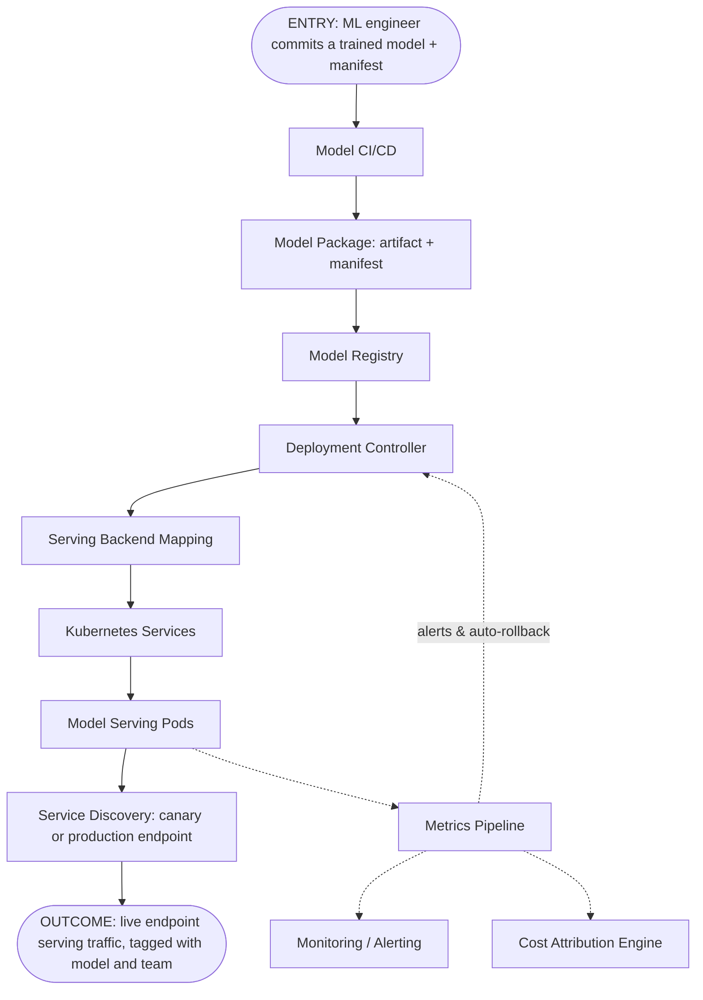
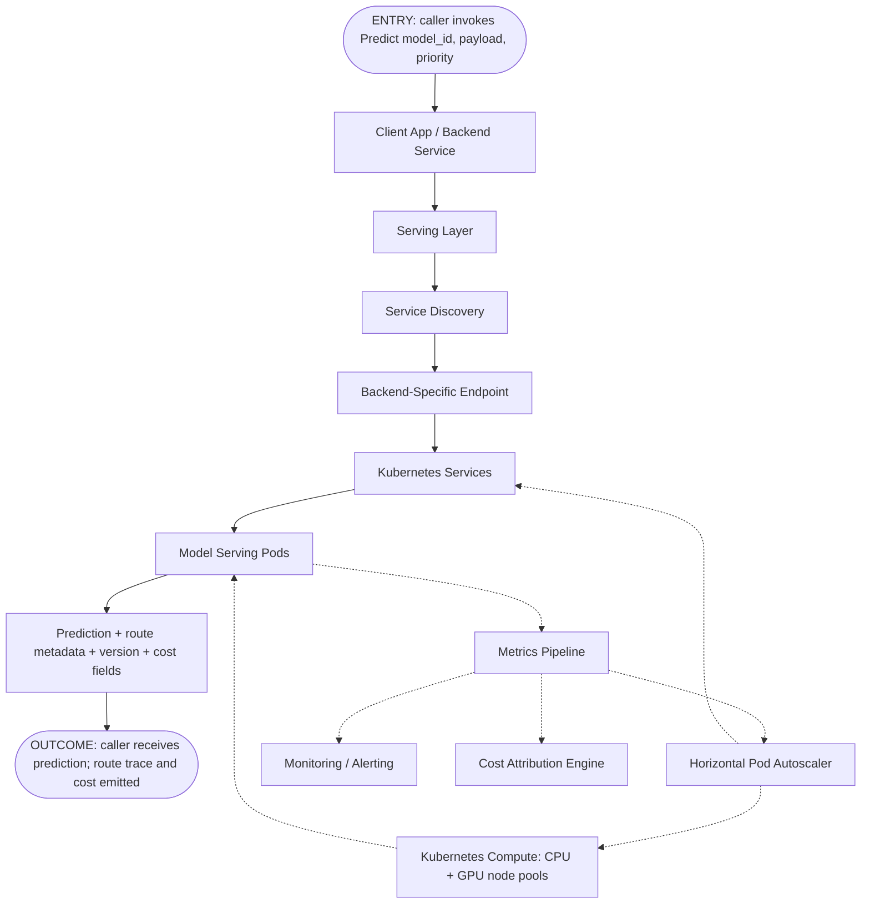

# Building a Unified Model Serving and Cost Optimization Platform

**Candidate:** Anil Muppalla  
**Role:** Sr. Engineering Manager, ML Infrastructure  
**Company:** Quince  
**Submission package:** This written memo, a runnable Python CLI prototype, tests and simulations, and an AI collaboration log.

---

## 1. Executive Summary

Quince has reached the point where independently deployed ML models are creating duplicated GPU spend, inconsistent latency and reliability, and limited visibility into model-level cost and health. My approach is to build a unified model serving platform in phases: first, unblock the Search Ranking and Personalization launches with a narrow paved path; then expand into a shared platform with cost attribution, SLA-aware routing, autoscaling, canary deployments, and self-service onboarding for 4+ ML teams.

**Primary outcomes by six months:**

- Reduce inference cost by **30%** while preserving model-specific latency SLOs.
- Establish a self-service deployment path for the first **2 pilot teams**, then expand to **4+ teams**.
- Cut model deployment lead time from ad hoc/manual processes to a measured, repeatable path.
- Provide model/team-level visibility into cost-per-prediction, latency, health, and utilization.

**My strategy in one sentence:** Start with a focused, measurable v1 that prevents new fragmentation, then use the pilot to prove cost, reliability, and developer-experience wins before broad migration.

---

## 2. Assumptions and Scope

Several implementation details are intentionally open. I'm making the following working assumptions and will validate them in the first two weeks.


| Area               | Assumption                                                                                                                 | If Wrong, Adjustment                                                                                                  |
| ------------------ | -------------------------------------------------------------------------------------------------------------------------- | --------------------------------------------------------------------------------------------------------------------- |
| Initial team       | The initial 3 engineers include platform/infrastructure depth, ML serving/runtime depth, and devex/observability coverage. | Narrow v1 scope, lean more heavily on SRE/platform partners, and prioritize hiring or borrowing Staff ML Infra depth. |
| Existing substrate | Quince already has some containerized/cloud deployment substrate, even if fragmented.                                      | Make v1 packaging, deployment templates, and observability the first milestone before advanced routing.               |
| Cost data          | Cloud/GPU cost data can be mapped to teams, endpoints, model IDs, or clusters with tagging cleanup.                        | Add a Phase 0 instrumentation milestone before claiming precise cost-per-prediction reductions.                       |
| V1 scope           | V1 focuses primarily on inference, with training cost visibility phased in later.                                          | Add a separate FinOps/data-platform workstream and resource request.                                                  |
| Talent profiles    | Talent assessment uses synthetic senior IC archetypes.                                                                     | If real profiles are expected, use only public information and avoid implying private knowledge.                      |
| Prototype depth    | Prototype demonstrates the idea; it is not production serving infrastructure.                                              | Expand tests, scenarios, and setup instructions if deeper implementation is expected.                                 |


**In scope for v1:** Search Ranking and Personalization pilot workloads; standard model packaging/deployment contract; basic registry integration, serving layer, cost attribution, health metrics, canary support, and routing policy.

**Not in scope for v1:** Full serving support of every existing ML endpoint, deep training workload optimization.

---

## 3. Impact Plan and Success Metrics


| Goal                 | Metric                                                                               | Baseline Needed                           | 3-Month Target                                | 6-Month Target                                     |
| -------------------- | ------------------------------------------------------------------------------------ | ----------------------------------------- | --------------------------------------------- | -------------------------------------------------- |
| Cost reduction       | GPU-hour spend and allocated inference cost per 1,000 predictions, by model and team | Current cloud/GPU cost and request volume | 10-15% reduction in pilot workloads           | 30% reduction across migrated workloads            |
| Latency reliability  | Tail latency: 95th and 99th percentile response time by model and priority           | Current pod latency                       | Pilot models meet agreed latency targets      | Agreed latency targets met for 4+ teams            |
| Platform adoption    | Number of teams/models onboarded                                                     | Current model inventory                   | Search + Personalization in production        | 4+ ML teams onboarded                              |
| Deployment speed     | Time-to-deploy: from manifest merged to production traffic at full ramp              | Current manual path                       | Repeatable deploy path for pilots             | Self-service deploy path with rollback             |
| Operational maturity | Alert coverage, gradual rollout usage, rollback readiness                            | Current incident/alert state              | Health dashboards and paging rules for pilots | Standard launch checklist for all onboarded models |
| Utilization          | GPU utilization and idle fleet cost                                                  | Current utilization by pod/fleet          | Identify idle/stale fleets                    | Automated recommendations and cleanup workflow     |


### How the 30% Decomposes

The 30% target isn't a slogan — it's built from five named levers, each with an owner and a phase. But the contribution percentages are assumptions: estimates of duplicated fleets, right-sizing headroom, and stale capacity drawn from comparable ML orgs, not measured at Quince. Phase 0 baselining is where those assumptions become real numbers.


| Lever                                                        | Target contribution | Mechanism                                                                                                                                                                                         | Owner                     | Delivery phase |
| ------------------------------------------------------------ | ------------------- | ------------------------------------------------------------------------------------------------------------------------------------------------------------------------------------------------- | ------------------------- | -------------- |
| Eliminate duplicated GPU fleets                              | 8-12%               | Migrating Search and Personalization onto the shared platform reclaims GPU capacity currently sitting in per-team bespoke reserves.                                                               | Platform + pilot ML teams | Phases 1–2     |
| Replace manual over-provisioning with horizontal autoscaling | 2-4%                | Per-model utilization-driven autoscaling replaces flat over-provisioning during spikes; planned-event pre-warm replaces guess-and-pad.                                                            | Platform                  | Phases 1–2     |
| Right-size migrated workloads                                | 5-10%               | GPU vs CPU choice, instance-class right-sizing (T4 / A10 / H100), batching policy. Per-model GPU and CPU utilization targets on the manifest make right-sizing a contract decision, not a debate. | Platform + ML teams       | Phases 1–3     |
| Spot / off-peak training capacity                            | 3-5%                | Move non-urgent GPU-heavy training to spot or region-aware off-peak windows. Shared cost attribution makes the savings auditable.                                                                 | FinOps + Platform         | Phases 2–3     |
| Decommission stale fleets                                    | 3-5%                | Cost engine surfaces idle or near-zero-traffic GPU pools held by teams "in case." Quarterly ownership reviews retire them.                                                                        | FinOps + Platform         | Phases 2–3     |
| **Total range**                                              | **21-36%**          | Range gives headroom against adoption risk and tagging gaps surfaced in Phase 0.                                                                                                                  |                           | —              |


The 30% target sits near the middle of this range. The worst plausible outcome is roughly **17–21%** by month six — slow migration under-delivers fleet reclaim and right-sizing; delayed training attribution slips spot savings; weak FinOps alignment under-delivers stale-fleet decommissioning. That threshold triggers a leadership conversation rather than a silent miss.

---

## 4. Phased Delivery Plan

### Phase 0: Discovery, Baseline, and Guardrails (Weeks 0-2)

**Goal:** Establish the facts needed to make cost and reliability claims credible.

- Build model inventory: owner, framework, inference pattern, SLA, traffic shape, current infra, cost owner.
- Baseline cost, latency, error rates, utilization, and deployment process for Search and Personalization.
- Agree on pilot success metrics, migration criteria, and launch guardrails.

**Done when:** Pilot workloads selected and owners named; baseline metrics visible; v1 scope and non-goals agreed with ML leads, Platform, SRE, and FinOps.

### Phase 1: Pilot Paved Path (Weeks 2-8)

**Goal:** Prevent new fragmentation by giving Search and Personalization a usable shared path next quarter.

- Standardize model packaging and deployment metadata.
- Stand up serving layer and model registry integration for pilot models.
- Add basic cost attribution and operational dashboards.
- Implement conservative SLA-aware routing; support canary deploys and automated rollback triggers.

**Done when:** Search and Personalization can deploy through the shared path; cost and latency reported per model/team; canary and rollback exercised before production launch.

### Phase 2: Optimization and Self-Service (Weeks 8-16)

**Goal:** Turn the pilot into a platform, not a one-off migration.

- Add autoscaling policies, right-sizing recommendations, and stale fleet detection.
- Add self-service onboarding workflow and golden-path documentation.
- Expand test coverage, chaos/failure drills, and launch checklist.
- Migrate 1-2 additional candidate workloads.

**Done when:** Demonstrated cost reduction in pilot workloads; onboarding runbook validated by at least one non-pilot team; SLOs and cost attribution visible for all onboarded models.

### Phase 3: Broader Adoption and Training Cost Visibility (Months 4-6)

**Goal:** Scale adoption and close the loop on the 30% cost reduction target.

- Expand to 4+ ML teams across real-time, near-real-time, and batch patterns.
- Add training workload cost visibility and recommendations as a FinOps extension.
- Establish quarterly platform reviews; decommission stale or duplicated fleets.

**Done when:** 30% inference cost reduction target measured against baseline for migrated workloads; platform becomes the default path for new model launches; remaining exceptions have explicit owners, timelines, and rationale.

**Guiding principle — agent-ready platform (Phase 2–3, not v1).** I keep v1 contracts and telemetry clear enough that we can later add a **ModelOps AI agent** to speed **onboarding**, **steady-state operations**, and **change hygiene** — surfacing PRs, diffs, summaries, and recommendations, with no direct production mutation and owners still in the loop.

---

## 5. Team Composition and Resource Plan

See §2 — **Initial team** in the assumptions table — for the working assumption that grounds the starting team below.

### Starting Team: 3 Engineers


| Role                                    | Primary Ownership                                             | Why It Matters                                                                |
| --------------------------------------- | ------------------------------------------------------------- | ----------------------------------------------------------------------------- |
| Senior/Staff Platform Engineer          | Serving layer, deployment path, production readiness          | Anchors the platform architecture and operational quality.                    |
| ML Serving/Runtime Engineer             | Model packaging, framework support, routing/batching behavior | Ensures the system fits real ML workloads instead of generic service hosting. |
| Platform Product/Observability Engineer | Self-service workflow, dashboards, cost reporting, docs       | Makes the platform adoptable by ML teams and measurable by leadership.        |


### Partner Support Needed

- **SRE:** production readiness reviews, alerting, on-call model, incident response.
- **FinOps/Finance:** cost baselines, tagging, allocation model, savings validation.
- **ML team leads:** model requirements, launch dates, correctness metrics, adoption.
- **Platform Engineering:** deployment substrate, CI/CD, secrets, networking, tenancy.

### Hiring Ask

Given the 6-month cost target and onboarding delay, I'm asking for two additional hires:

- **1 Staff ML Infrastructure Engineer** focused on serving runtime, GPU utilization, batching, and performance.
- **1 Senior Platform/FinOps Engineer** focused on cost attribution, right-sizing automation, and stale fleet cleanup.

Because hiring takes 2-3 months, these roles support Phase 2/3 scale-out rather than the first pilot milestone.

**If hiring slips:** The pilot does not need these two roles; scaling the program past the pilot does. If both are still open after month four, I keep the platform at **pilot-stable**: cost views stay read-only, every gradual rollout needs owner sign-off, and Recommendations migration waits. I escalate to leadership at that point — savings drift toward the **17–21%** downside band, not the full 30%. The fallback is borrowed capacity from SRE, Platform, and FinOps plus extended pilot-team embeds. I do not cover the gap by overloading the starting three.

---

## 6. Stakeholders, Ownership, and Communication


| Stakeholder                         | Role             | Responsibility                                                    |
| ----------------------------------- | ---------------- | ----------------------------------------------------------------- |
| Search Ranking ML Lead              | Pilot customer   | Requirements, model quality metrics, launch readiness.            |
| Personalization ML Lead             | Pilot customer   | Requirements, launch timing, adoption feedback.                   |
| Recommendations/Pricing/Fraud Leads | Future customers | Onboarding candidates, roadmap input, migration prioritization.   |
| Platform Engineering                | Partner          | Deployment substrate, CI/CD, shared infrastructure standards.     |
| SRE                                 | Partner          | Reliability reviews, alerting, incident response, on-call model.  |
| FinOps/Finance                      | Partner          | Cost baselines, savings validation, tagging model.                |
| Product/Business Owners             | Stakeholders     | Latency/business impact tradeoffs, launch timing, risk tolerance. |
| Engineering Leadership              | Sponsor          | Scope decisions, headcount, cross-team prioritization.            |


**Embedded engineer rotation.** Search Ranking and Personalization each contribute one engineer part-time during the Phase 1 sprint window to co-build the manifest contract and onboarding path. These engineers bring model-specific domain context and become the adoption advocates back in their home teams. The same rotation is offered to Phase 3 teams (Recommendations, Pricing, Fraud) at the start of their migration sprints.

---

## 7. Technical System Design

### Architecture Overview

The platform provides a shared serving layer with clear separation between model ownership and infrastructure policy. ML teams own model quality and business correctness metrics; the platform owns deployment standards, routing policy, cost visibility, reliability controls, and operational guardrails. Three flows share the same substrate — Kubernetes compute, metrics pipeline, cost attribution engine — but each has a distinct entry point, control plane, and outcome.

### Core Components


| Component               | Owns                                                                            |
| ----------------------- | ------------------------------------------------------------------------------- |
| Model Registry          | Model metadata, versions, artifact URIs, SLA tier, rollback target              |
| Serving Layer           | Request path, model ID resolution, routing policy invocation, response metadata |
| Deployment Controller   | Canary percentages, rollback target, config validation, launch state            |
| Runtime Pools           | CPU and GPU pools; framework-specific containers (PyTorch, TF, ONNX, vLLM)      |
| Autoscaler              | Utilization-driven scaling, planned-event pre-warm, cost guardrails             |
| Cost Attribution Engine | Cost-per-model/team, utilization, idle capacity, stale fleet detection          |
| Monitoring and Alerting | Latency, errors, canary deltas, business guardrails, team dashboards            |


### Deployment Flow — ML team ships a trained model




The deployment controller selects the runtime image from `model_type` + `serving_backend`, provisions candidate-version pods, and registers the canary endpoint with service discovery. Promotion is a rolling replacement — new pods take traffic, old pods drain and terminate — so a half-deployed state never serves production traffic.

### Serving Flow — client request lands on a model




The serving layer resolves `model_id` via service discovery. The autoscaler uses `target_gpu_util_pct` (or `target_cpu_util_pct`) — the same value the router uses for high-priority headroom — so one definition of "too hot" is propagated end-to-end.

### Routing Policy

The routing policy filters for correctness, SLA feasibility, and per-model utilization headroom before choosing the lowest-cost viable target. High-priority requests overflow to faster capacity when no SLA-feasible pod exists; normal/low priority fail closed with an explainable reason.

---

## 8. Multi-Model and Multi-Team Serving

**Framework support is plugin-based.** PyTorch, TensorFlow, ONNX, and gradient-boosted models (xgboost LTR) share the same model registry, serving layer, deployment manifest, observability surface, and cost attribution engine. Only the runtime container differs — Triton, TF Serving, ONNX Runtime, vLLM, or a custom adapter — and the deployment controller picks it from `model_type` + `serving_backend` on the manifest.

### One manifest, many runtimes

The prototype's `Model` primitive is the contract every framework conforms to. Two real manifests from the bundled scenarios:

```python
Model(                                  # GPU + Triton (Search Ranking)
    model_id="search-ranking-v1",
    owner_team="search",
    model_type="xgboost_ltr",
    serving_backend="triton",
    version="1.0.0",
    sla_ms=50,
    priority_tier="high",
    batching_window_ms=0,
    requires_gpu=True,
    target_gpu_util_pct=50,
    target_cpu_util_pct=60,
)

Model(                                  # CPU + ONNX Runtime (Fraud Detection)
    model_id="fraud-detection-v1",
    owner_team="fraud",
    model_type="onnx",
    serving_backend="onnx_runtime",
    version="2.3.7",
    sla_ms=80,
    priority_tier="high",
    batching_window_ms=0,
    requires_gpu=False,
    target_gpu_util_pct=50,
    target_cpu_util_pct=60,
)
```

Same shape, different runtimes. Workload patterns are not separate platform features — they are combinations of manifest fields: `sla_ms` + `priority_tier` (latency tier), `requires_gpu` + utilization targets (compute substrate), `batching_window_ms` (batching tolerance), `model_type` + `serving_backend` (framework/runtime). Onboarding a new model is a config change, not a platform code change.

### Migration Path For Non-Pilot Teams

Search Ranking and Personalization are the v1 pilots. The other three teams migrate in Phase 3, sequenced by urgency, compatibility, and risk:

- **Recommendations** — **wrap-and-keep**: batch refresh moves first onto the shared cost attribution engine while existing online ranking stays in place.
- **Dynamic Pricing** — **direct migration**: CPU-backed, same manifest fields, higher `target_cpu_util_pct`.
- **Fraud Detection** — **shadow first, then canary, with extended owner review**: shadow runs 4–6 weeks at zero customer risk before any live traffic exposure; canary requires owner sign-off on every promotion.

Phase 0 discovery names the actual blockers per team. The migration sequence is re-validated at Phase 1 exit.

---

## 9. Safe Deployments and Rollback

Two principles drive the platform's safety story:

1. **Layer the deployment modes.** Shadow first for high-stakes models, then canary evaluated against guardrails (auto-promote / hold / owner-review / rollback), then rolling-replacement promotion. Every traffic-affecting change goes new-pods-up-then-old-pods-down.
2. **Evaluate operational and statistical guardrails together in the canary.** Operational regressions auto-rollback. Statistical regressions escalate to owner review because the trade-off is judgment-dependent.

**Deployment modes:** Shadow (copied traffic, responses not served) → Canary (small live slice) → Progressive rollout (traffic share increases as guardrails stay healthy) → Full promotion (rolling replacement, previous version pinned as rollback target). Rollback runs the same mechanism in reverse.

### Canary Evaluation Guardrails (v1, implemented in the prototype)


| Gate                        | Condition                                                           | Action                                                                   |
| --------------------------- | ------------------------------------------------------------------- | ------------------------------------------------------------------------ |
| Observation gate            | Observations < `min_observations`                                   | `hold_canary` — wait for sufficient sample                               |
| Operational hard guardrails | P99 latency, error rate, timeout rate, or FPR regression vs control | `rollback`                                                               |
| Quality soft guardrails     | Precision or recall drop vs control                                 | `requires_owner_review`                                                  |
| Business attribution        | Chargeback rate / revenue impact                                    | Not evaluated in canary window (lagged); captured in 30/60/90-day review |


Guardrail values are set explicitly per rollout — no named class abstraction. The CLI prints `effective_guardrails` so the evaluation policy is auditable end-to-end.

v2 roadmap adds queue saturation, drift/calibration decomposition, and absolute SLO breach as additional guardrails.

Automated rollback applies to clear operational guardrail breaches. Statistical evaluation falls back to **owner review** when sample sizes are small, business metrics are noisy, or a wrong promotion has direct user impact.

---

## 10. Execution, Tracking, and Delivery Management

I track delivery against a milestone plan covering Phase 0/1/2/3 deliverables with a shared launch checklist for pilot readiness, weekly risk reviews covering timeline, staffing, dependency, and adoption risks, and status reports that lead with measurable metrics. Every change goes through shadow/canary before serving live production traffic, behind feature flags where applicable, with runbooks owned jointly by SRE, platform, and ML model owners.

### Launch Checklist

Every model migration passes this checklist before serving production traffic. Items are owned, not just listed.

1. **Manifest validated.** `model_id`, owner, `model_type`, `serving_backend`, `sla_ms`, `target_gpu_util_pct` / `target_cpu_util_pct`, and rollback target all present and correct. Owner: model owner.
2. **SLA targets aligned.** Manifest fields match the agreed product SLA and the headroom the model needs. Owner: model owner + this role.
3. **Canary guardrails configured.** Latency / error / timeout / FPR regression budgets and precision / recall drop limits set explicitly per rollout, plus `min_observations`. Owner: model owner + platform.
4. **Rollback target pinned.** Previous stable deployment pointer restorable via service discovery; restoration tested in non-prod. Owner: platform + SRE.
5. **Cost attribution live.** Cost dashboard tagged and showing data; FinOps confirms attribution is credible. Owner: FinOps + platform.
6. **Reliability wired.** Alert paging routes, SLO documented, canary deltas monitored, capacity-exhaustion runbook linked. Owner: SRE + platform.
7. **Sign-off captured.** Model owner, platform owner, and SRE confirm at launch readiness review; decision recorded. Owner: this role.

---

## 11. Prototype: Cost-Aware Inference Routing Simulation

I built a standard-library Python prototype under `prototype/` that exercises the core platform decisions on deterministic scenarios. The primary surface is a generated standalone HTML report; the CLI is the reproducible verification path.

1. **Cost-aware, SLA-respecting routing** with per-model high-priority headroom on the right axis (GPU for GPU-backed, CPU for CPU-backed).
2. **HPA-style autoscaler signals** on per-model GPU and CPU utilization targets, planned-event pre-warm, and unhealthy-pod replacement.
3. **Canary policy**: auto-promote, owner review, hold-on-low-sample, rollback on operational breach.
4. **Failure modes**: endpoint unavailability with high-priority overflow to healthy capacity, organic spike, and planned promotion.

The same `target_gpu_util_pct` on the model manifest drives both the autoscaler scale trigger and the router's high-priority headroom check — one definition of "too hot" per model, propagated through both subsystems. Full repository structure is documented in the prototype README.

### How To Run

```bash
cd prototype

# List bundled scenarios.
python -m modelops_platform list

# Run one scenario with full human-readable output.
python -m modelops_platform run scenarios/02_organic_spike.json

# Run every bundled scenario.
python -m modelops_platform run-all

# Generate the browser-friendly simulation report.
python -m modelops_platform report-html --output simulation-report.html

# Run the unit tests.
python -m unittest discover -s tests -t .
```

Open `prototype/simulation-report.html` in a browser for the full walkthrough. Each scenario has its own page under `simulation-report-scenarios/`.

### Prototype Limitations

The autoscaler emits recommendations but does not mutate any cluster. Scenarios encode point-in-time state; there is no live metrics pipeline or streaming traffic. Backend runtime details (Triton config, vLLM) are represented through `serving_backend` metadata only. Training/batch policy is described in the memo but not implemented in the CLI. Each `Endpoint` object maps 1:1 to one pod for routing simplicity; in production a Kubernetes Service would front many pods.

The point of the prototype is to make routing, autoscaling, and canary decisions visible in code — not to reproduce the production platform.

---

## 12. AI Collaboration Summary

I used Cursor as a coding and drafting partner throughout — for decomposition, prototype implementation, test generation, and red-team critique. I treated every output as a draft, not authority: routing, autoscaling, and canary logic were validated through scenario tests, manual route traces, cost reports, and code/doc audits before I accepted any of it. The pattern was: constrained prompt → inspect output → add tests for edge cases → correct where behavior diverged from intent.

**Two prototype corrections surfaced by running the code.** A test was asserting that a high-priority request with no SLA-feasible capacity should be `rejected_sla` — the opposite of the intended policy (high-priority should overflow to the fastest available pod). Separately, the first autoscaler averaged GPU utilization across all pods: a hot pod at 82% plus a cool reserve at 12% averaged to 59.7%, just under the 60% target, so the autoscaler emitted `stable` while the hot pod was clearly over target. Fix: switched to max-pod GPU utilization as the scale trigger. Both caught by running the code, not by inspecting it.

`**math.ceil` autoscaler bug.** When I made GPU and CPU utilization targets explicit per-model fields on the manifest, new tests caught a real bug: the autoscaler used `int(round(current_replicas * scale))`. With one replica at 55% vs a 50% target, `round(1 × 1.1)` returns `1` — no scale-up at all. Real Kubernetes HPA uses ceiling for scale-up. Switched to `math.ceil`.

**Red-team audit: five code/doc inconsistencies, all fixed.** The most significant: the router used a hard-coded headroom threshold (`0.6`) while the autoscaler used per-model targets (`50/60/75/85%`), meaning the two subsystems had different definitions of "too hot" for the same model. Fixed by making the router call the same `utilization_targets_for_model` helper the autoscaler already used.

**Removed the SLA class abstraction.** AI built named SLA class groupings (`strict_realtime`, `realtime`, etc.) with class-driven defaults. I challenged whether the indirection added value. The symmetry between router headroom and autoscaler trigger just needed both subsystems to read the same manifest field, not a class lookup. Removed the class layer entirely; `target_gpu_util_pct` and `target_cpu_util_pct` are now explicit on every model manifest.

**Fraud canary terminology: three challenges, three fixes.** (1) "Business retention" cannot be measured in a canary window — chargebacks lag by days to weeks. Removed; the real-time signal is approval rate, captured by FPR. (2) Sample size is a confidence precondition, not a metric comparison. Recategorized as `min_observations`. (3) "Fraud-quality retention" is not industry terminology. Replaced with `precision`, `recall`, and `false_positive_rate`. FPR promoted to a hard gate alongside latency — FPR increasing means legitimate customers are being blocked, which is immediate user-facing harm.

---

## 13. Talent Assessment

Four synthetic senior IC archetypes — not based on real candidates or private working knowledge. Priorities A and B are the direct hires supporting Phase 2/3 scale-out; C and D can be borrowed or fractional during the pilot.


| #   | Role                                                                                   | Gap closed                                                                                                                      | Hire shape                                                         | Risks mitigated                                                           |
| --- | -------------------------------------------------------------------------------------- | ------------------------------------------------------------------------------------------------------------------------------- | ------------------------------------------------------------------ | ------------------------------------------------------------------------- |
| A   | **Staff ML Infrastructure Engineer** · 10+ yrs · shared inference platform             | GPU memory pressure, batching at P99, runtime adapters (PyTorch / TF / ONNX / vLLM) — the serving depth the starting team lacks | Direct hire, Phase 2/3 (2–3 month onboard)                         | Three-person team too thin; both hires slip → 30% target slips to 17–21%  |
| B   | **Senior Platform / FinOps Engineer** · GPU cost attribution · right-sizing automation | Turns GPU spend into action: tagging model, cost-attribution engine, right-sizing recommendations, stale-fleet cleanup          | Direct hire, Phase 2/3                                             | Cost savings not measurable; FinOps + ML cannot agree on "stale" criteria |
| C   | **Senior Platform Product / DX Engineer** · self-service deployment paths              | Prevents the platform from being technically correct but unused; owns manifest contract, onboarding path, adoption loops        | Direct hire OR borrowed senior from Platform Eng for 6 months      | Pilot teams bypass platform; platform becomes one-size-fits-all           |
| D   | **Senior SRE with ML Systems Exposure** · SLOs · canary · incident response            | Operational maturity without slowing teams; has worked with model owners on statistical regressions, not only operational ones  | Borrowed/fractional from SRE org during pilot; direct hire Phase 3 | Statistical canaries noisy; autoscaling increases instability or cost     |


---

## 14. Risks and Mitigations


| Risk                                                       | Impact                                              | Mitigation                                                                                               |
| ---------------------------------------------------------- | --------------------------------------------------- | -------------------------------------------------------------------------------------------------------- |
| Pilot teams bypass platform due to timeline pressure       | Fragmentation worsens                               | Deliver narrow v1 path for Search and Personalization first; avoid overbuilding.                         |
| Cost savings are not measurable                            | Leadership loses confidence                         | Phase 0 baselines, tagging, cost attribution, and FinOps validation.                                     |
| Platform becomes one-size-fits-all                         | ML teams resist adoption                            | Standardize control plane and guardrails while allowing runtime-specific execution.                      |
| Statistical canaries are noisy                             | Wrong promotion/rollback decisions                  | Pre-agreed guardrails, shadow mode, minimum sample sizes, human review for ambiguous metrics.            |
| Three-person team is too thin                              | Timeline or quality risk                            | Tight v1 scope, partner leverage, and early hiring request.                                              |
| Autoscaling increases instability or cost                  | Reliability/cost regression                         | Conservative policies, feature flags, load tests, and staged rollout.                                    |
| Both hires slip past month four                            | Phase 2/3 scale-out stalls; 30% target at risk      | Hold at pilot-stable; escalate to leadership; extend embedded rotation and borrowed SRE/FinOps capacity. |
| FinOps and ML teams cannot agree on "stale" fleet criteria | Stale-fleet decommission lever (3–5%) underdelivers | Define "stale" in writing in Phase 0 and get FinOps + ML lead sign-off before Phase 2 reviews begin.     |


